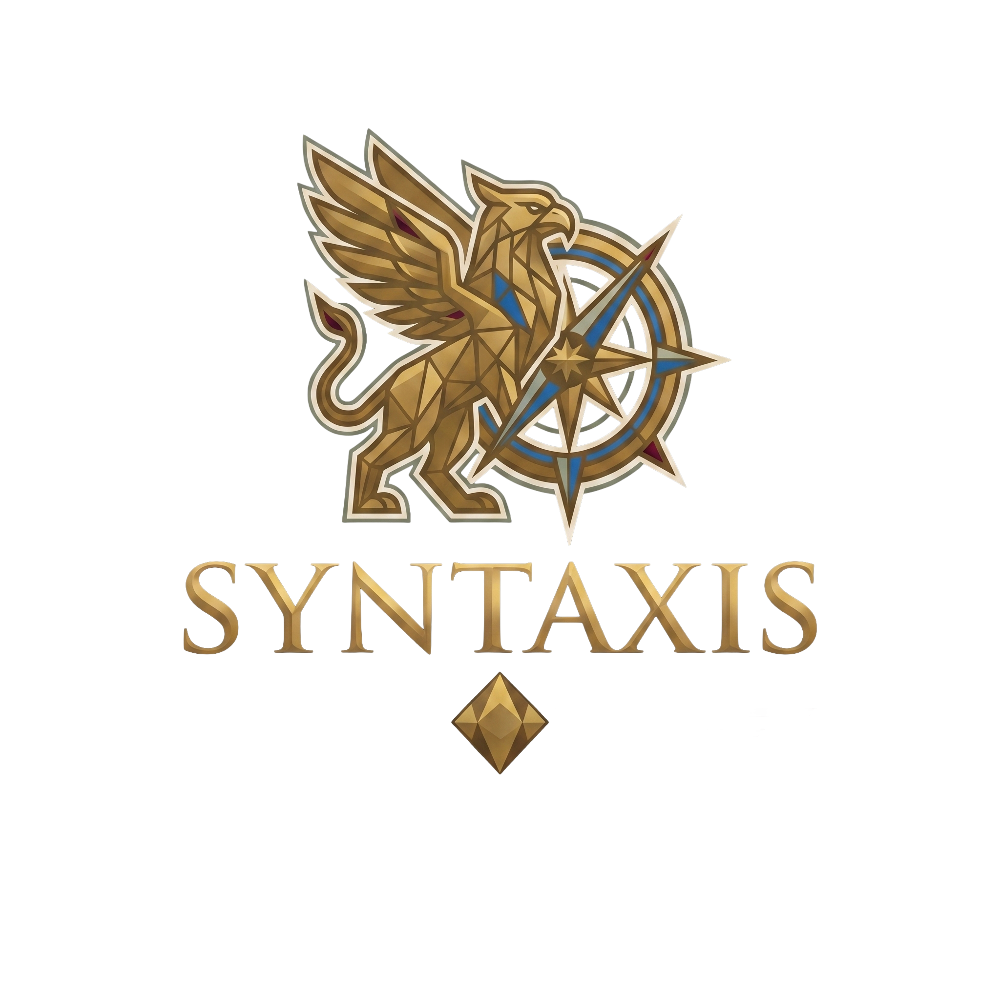

<div align="center">

<!-- Logo -->


# SYNTAXIS 2026

### ⚡ NCR's Premier Inter-College Tech Fest

**R.D. Engineering College (RDEC), Ghaziabad**

**September 18 – 20, 2026**

[](https://github.com/)
[](https://www.typescriptlang.org/)
[](https://react.dev/)
[](https://vite.dev/)
[](https://tailwindcss.com/)
[](./package.json)

---

*Connecting **25+ NCR colleges** and **700–900 participants** across three days of innovation, collaboration, and competition.*

[🌐 Live Site](https://syntaxis.rdec.ac.in) · [📧 Contact](mailto:syntaxis@rdec.in) · [🎓 College Website](https://rdec.ac.in)

</div>

---

## ✨ Overview

**Syntaxis 2026** is the flagship tech fest of R.D. Engineering College, organized by the **Nexora Tech Club**. This repository contains the official event website — a high-performance single-page application featuring an immersive WebGL plasma background, glass morphism UI, Framer Motion animations, and a fully responsive design.

> *"Syntaxis" — from the Greek root meaning order, arrangement, and systematic coordination.*

---

## 🏛️ Architecture

```
syntaxis/
├── public/                    # Static assets (logos, placeholders, SEO files)
│   ├── assets/
│   │   ├── logo/              # College banner, Syntaxis logo
│   │   ├── events/            # Event poster placeholders
│   │   ├── speakers/          # Speaker photo placeholders
│   │   ├── sponsors/          # Sponsor logo placeholders
│   │   └── team/              # Organizing team member photos
│   ├── favicon.svg
│   ├── robots.txt
│   └── sitemap.xml
├── src/
│   ├── App.tsx                # Root layout — BG + Nav + Sections + Footer
│   ├── main.tsx               # Vite entry point
│   ├── index.css              # Design tokens + global styles
│   ├── components/
│   │   ├── bg/                # WebGL plasma + static gradient fallback
│   │   ├── carousel/          # Embla-based event carousel (mobile)
│   │   ├── effects/           # Sniper click reticle effect
│   │   ├── icons/             # Custom SVG social icons
│   │   ├── nav/               # Notch-style navigation bar
│   │   ├── ui/                # Reusable primitives (Card, Badge, Button, etc.)
│   │   └── Footer.tsx
│   ├── sections/              # 10 page sections
│   │   ├── Hero.tsx           # Landing with countdown + CTAs
│   │   ├── About.tsx          # Stats, narrative, three pillars
│   │   ├── Events.tsx         # Filterable event grid + mobile carousel
│   │   ├── GenesisTrack.tsx   # Junior division (Classes 9-12)
│   │   ├── Schedule.tsx       # 3-day timeline with tab navigation
│   │   ├── Speakers.tsx       # Keynote speaker cards
│   │   ├── Sponsors.tsx       # Tiered sponsor showcase
│   │   ├── Register.tsx       # Registration CTA block
│   │   ├── FAQ.tsx            # Accordion-style FAQs
│   │   └── TeamContact.tsx    # Team cards + Web3Forms contact form
│   ├── hooks/
│   │   └── useCountdown.ts    # Countdown timer + reveal date logic
│   └── lib/
│       └── constants.ts       # Section IDs, external links, fest info
├── vite.config.ts             # Vite build configuration
├── tailwind.config.ts         # Tailwind CSS v4 theme extensions
├── tsconfig.app.json          # Strict TypeScript configuration
└── package.json
```

---

## 🎨 Design System

The site uses a curated dark-mode palette defined entirely through **CSS custom properties**, ensuring consistent theming across all components.

| Token | Color | Usage |
|-------|-------|-------|
| `--color-bg` | `#11100e` | Primary background |
| `--color-accent` | `#5d1c34` | Accent / Crimson |
| `--color-brand` | `#a67d45` | Hero brand / Gold |
| `--color-text-sec` | `#899581` | Secondary text / Sage |
| `--color-text-body` | `#cdbbad` | Body text / Parchment |
| `--color-text-pri` | `#f0e9e3` | Primary text / Ivory |

**Typography**: Cinzel (headings) · Inter (body) · JetBrains Mono (code/timer)

---

## ⚡ Tech Stack

| Layer | Technology | Purpose |
|-------|-----------|---------|
| **Framework** | React 19 | Component architecture |
| **Language** | TypeScript 6.0 | Strict type safety |
| **Bundler** | Vite 8 | Fast HMR + production builds |
| **Styling** | Tailwind CSS 4 + CSS Variables | Utility-first + design tokens |
| **Animation** | Framer Motion 12 | Scroll-triggered animations |
| **Background** | WebGL (Custom GLSL Shader) | Interactive plasma effect |
| **Carousel** | Embla Carousel | Touch-friendly mobile event slider |
| **Navigation** | react-scroll | Smooth in-page scrolling |
| **Icons** | Lucide React + Custom SVGs | Consistent icon system |
| **Contact** | Web3Forms API | Serverless email integration |
| **Linting** | oxlint | Fast Rust-based linter |

---

## 🚀 Getting Started

### Prerequisites

- **Node.js** ≥ 18.0
- **npm** ≥ 9.0

### Installation

```bash
# Clone the repository
git clone https://github.com/your-org/syntaxis.git
cd syntaxis

# Install dependencies
npm install
```

### Development

```bash
# Start dev server with hot reload
npm run dev

# Lint the codebase
npm run lint
```

### Production Build

```bash
# Type check + build for production
npm run build

# Preview the production build locally
npm run preview
```

---

## 📦 Bundle Performance

| Chunk | Size (gzip) |
|-------|------------|
| App code | 21.35 KB |
| React + ReactDOM | 64.78 KB |
| Framer Motion | 13.88 KB |
| Embla Carousel | 7.99 KB |
| CSS | 9.04 KB |
| Other vendors | 33.29 KB |
| **Total** | **~152 KB** |

---

## 🌐 Deployment

The site is configured for deployment at `syntaxis.rdec.ac.in` as a dedicated subdomain.

```bash
# Build the production bundle
npm run build

# Deploy the `dist/` directory to your server
# The output is a static SPA — serve with any static file server
```

### Nginx Configuration (Example)

```nginx
server {
    listen 80;
    server_name syntaxis.rdec.ac.in;
    root /var/www/syntaxis/dist;
    index index.html;

    location / {
        try_files $uri $uri/ /index.html;
    }

    # Cache static assets
    location /assets/ {
        expires 1y;
        add_header Cache-Control "public, immutable";
    }
}
```

---

## 🔧 Configuration

All festival configuration lives in [`src/lib/constants.ts`](src/lib/constants.ts):

```typescript
// Section navigation IDs, external links, festival metadata
export const FEST_INFO = {
  name:     'SYNTAXIS 2026',
  dates:    'September 18–20, 2026',
  venue:    'R.D. Engineering College, Ghaziabad',
  target:   new Date('2026-09-18T09:00:00+05:30'),
  colleges: '25+',
  participants: '700–900',
}
```

### Pre-Launch Checklist

Before going live, update the following placeholders in `constants.ts`:

- [ ] `PRAGMA_REGISTRATION_URL` → Production Pragma EMS link
- [ ] `SYNTAXIS_INSTAGRAM_URL` → Official Instagram page
- [ ] `SYNTAXIS_LINKEDIN_URL` → Official LinkedIn page
- [ ] `SYNTAXIS_TWITTER_URL` → Official Twitter/X page

---

## 📱 Accessibility & Performance

- **Mobile-first responsive** design across all breakpoints
- **WebGL fallback**: Static gradient on mobile / low-end devices
- **Reduced motion**: All animations disabled when `prefers-reduced-motion` is active
- **Touch-optimized**: Mouse effects disabled on coarse pointer devices
- **Lazy loading**: All images use `loading="lazy"`
- **Semantic HTML**: Proper heading hierarchy (`h1` → `h6`)
- **ARIA labels**: All interactive elements are labeled
- **Custom scrollbar**: Themed thin scrollbar matching the design system

---

## 🗓️ Event Schedule

| Day | Date | Highlights |
|-----|------|------------|
| **Day 1** | Sep 18 | Inauguration, Syndesis Workshop, Logika DSA Workshop, Rhesis Talks |
| **Day 2** | Sep 19 | Heureka, Agon CP Contest, Katharsis Debug Duel, Pantheon Games |
| **Day 3** | Sep 20 | Genesis Track, Pythia Expo, Eureka Pitch Finals, Tribunal, Valediction |

---

## 👥 Organizing Team

| Member | Role |
|--------|------|
| **Rehaan Ahmad** | Technical Director |
| **Anurag Kumar** | Operations Director |
| **Palak Tyagi** | Executive Director |
| **Priyanshi Garg** | Marketing Head |
| **Prabhati Pandey** | Creative Head |
| **Priya Sharma** | Documentation Head |

> Organized by **Nexora Tech Club** & **GFG Student Community** — RDEC

---

## 📄 License

This project is **UNLICENSED** — proprietary to R.D. Engineering College. All rights reserved.

---

<div align="center">

**Built with ❤️ by the Nexora Tech Club**

*R.D. Engineering College, Ghaziabad*

</div>
